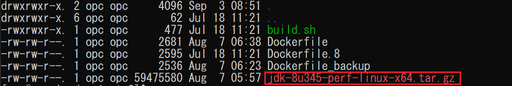
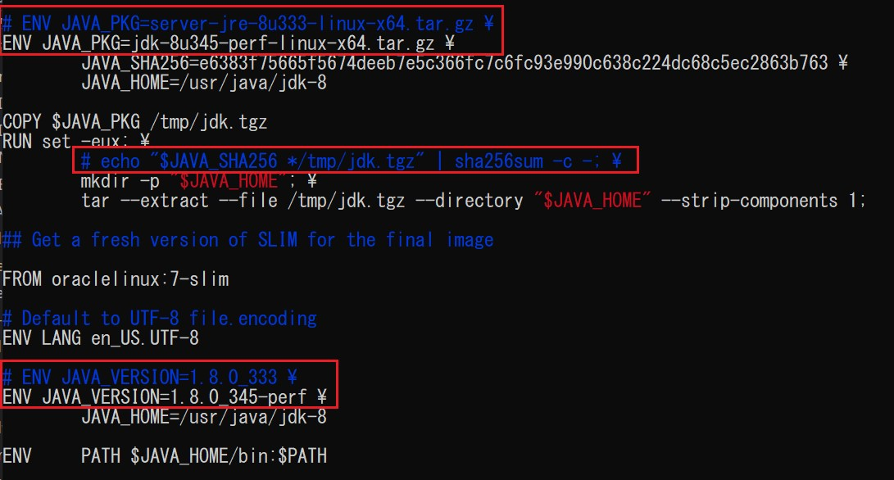
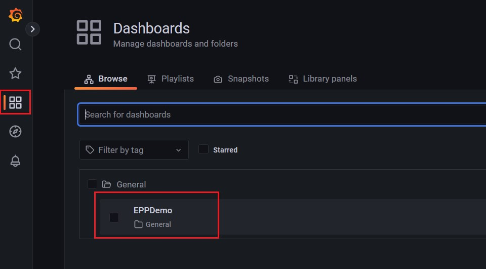
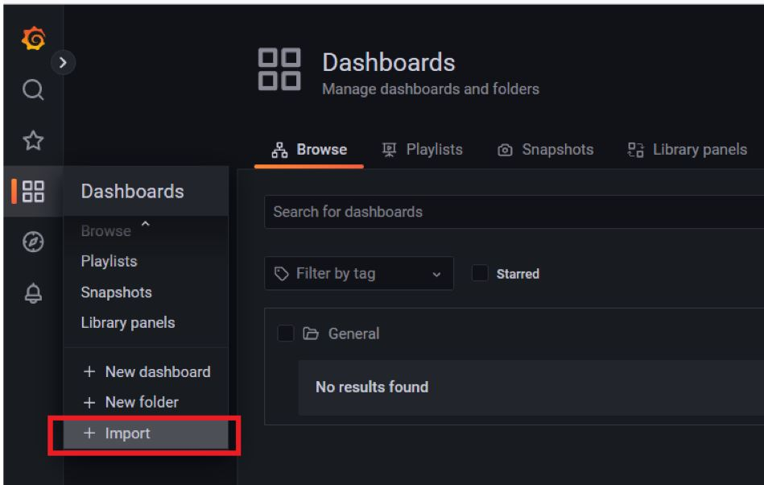
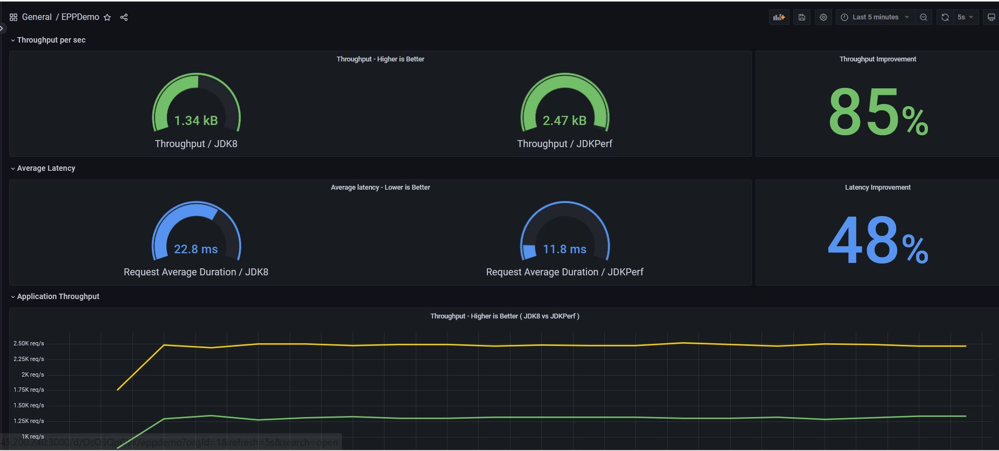

# Java-Enterprise-Performance-Pack-Demo
Performance comparison demo between legacy JDK8 and Java Enterprise Performance Pack  
## Overview  
* This demo is a fork from [Java Performance Comparison Dashboard Demo](https://github.com/swseighman/Java-Perf-Gafana) created by Scott Seighman and Kris Foster.
* Use same sample benchmark of Prime Numbers API service as above Demo.
* This demo compares throughput and latency by running benchmark parallelly in two containers, which base on Java Enterprise Performance Pack and legacy JDK8.

## Prerequsites
* Oracle Java 1.8.0_341
* Apache Maven 3.6.3
* Docker 19.03.11
* Docker Compose 2.5.0

> **NOTE:** If you are using a different Docker Compose version, customize the version number inside docker-compose.yml accordingly

## Demo Environment
* OCI instance with 8 cores, 64GB of memory, Oracle Linux7.9

## Contents
* **[Step1: Create docker image with Java Enterprise Performance Pack](#Step1-Create-docker-image-with-Java-Enterprise-Performance-Pack)**

* **[Step2: Build sample project](#Step2-Build-sample-project)**
   
* **[Step3: Run the demo](#Step3-Run-the-demo)**

## Step1: Create docker image with Java Enterprise Performance Pack
Use Oracle Linux7 based Dockerfile(Offered as Open Source at Oracle) to create Java Performance Pack image.

### 1. Clone the Docker Images from Oracle
```
git clone https://github.com/oracle/docker-images
```

```
cd docker-images/OracleJava/8
```

### 2. Download the binaries of Java Enterprise Performance Pack for Linux x64

Download the binaries available via MyOracleSupport.
[](https://jpg-data.us.oracle.com/artifactory/re-release-local/jdk/8u345-perf/6/bundles/linux-x64/jdk-8u345-perf-linux-x64.tar.gz)

Put the binary file under the directory of "docker-images/OracleJava/8".

### 3. Edit Dockerfile to correspond to Java Enterprise Performance Pack
```
cd docker-images/OracleJava/8
```
```
vi Dockerfile
```

Change the java binary package name and java version to correspond to Java Enterprise Performance Pack.

* Comment out the package name and add revised contents instead.
```
# ENV JAVA_PKG=server-jre-8u333-linux-x64.tar.gz \
```
```
ENV JAVA_PKG=jdk-8u345-perf-linux-x64.tar.gz \
```

* Also comment out the java version and add revised contents instead.
```
# ENV JAVA_VERSION=1.8.0_333 \
```
```
ENV JAVA_VERSION=1.8.0_345-perf \
```

* Comment out the checksum part to avoid conflict while creating the docker image.
```
# echo "$JAVA_SHA256 */tmp/jdk.tgz" | sha256sum -c -; \
```



### 4. Create Docker images based on Java Enterprise Performance Pack
```
cd docker-images/OracleJava/8
```

```
docker build --file Dockerfile --tag oracle/jdkperf:8 .
```

Confirm the docker image has been successfully created.

```
[opc@eppdemo 8]$ docker images
REPOSITORY          TAG                 IMAGE ID            CREATED             SIZE
oracle/jdkperf      8                   50c69cee9af6        4 seconds ago       316MB
<none>              <none>              f9b0fbbfa2b2        25 seconds ago      363MB
oraclelinux         7-slim              6a34bf539669        13 days ago         133MB
```

## Step2: Build sample project
### 1. Clone the repository
Move to a new directory to download the sample project.
```sh
git clone https://github.com/junsuzu/Enterprise-Performance-Pack.git
```

### 2. Run script to build the sample project and docker images

```
cd Enterprise-Performance-Pack/demo
```
```
chmod +x ./*
```
```
./build.sh
```

During building process, enter user name and password of your oracle account for access to oracle container registry.
```
[INFO] ------------------------------------------------------------------------
Building Java - DONE
Building docker containers...
Username (******@oracle.com): ******@oracle.com
Password:
```

After the script being executed successfully, docker images should have been created as below: 

```
[opc@eppdemo demo]$ docker images
REPOSITORY                                     TAG                 IMAGE ID            CREATED              SIZE
localhost/primes                               oraclejdkperf       1cda52d0f598        About a minute ago   336MB
localhost/primes                               oraclejdk8          7d9b022c5b09        About a minute ago   336MB
oracle/jdkperf                                 8                   9b4780818b52        2 hours ago          316MB
<none                                         <none              2f2e3d10cdff        2 hours ago          363MB
oraclelinux                                    7-slim              6a34bf539669        11 days ago          133MB
container-registry.oracle.com/java/serverjre   latest              ecd4aec3df76        6 weeks ago          316MB
```

## Step3: Run the demo
### 1. Start containers
```
cd Enterprise-Performance-Pack/demo
```
Run docker-compose command to start all necessary docker containers.
```
docker-compose up
```
### 2. Configure Grafana Dashboard
Navigate to: http://your-instance-ip:3000/login to access the Grafana dashboard (Make sure you have added Ingress rule on your OCI demo instance to make port of 3000 being opened), and login with admin/admin for username/passowrd.(You can click "skip" to skip changing password)

Click on the Dashboards icon on the left of the Grafana interface and choose EPPDemo on the right panel:


You will find throughput and latency comparison between Performance Pack and legacy JDK8 as below.



If you change the parameter of "upperBound" from 9999 to 99999 in docker-compose.yml, to make the load testing much more intensively, you will find the performance differentiated significently between two JDK runtimes as below:


